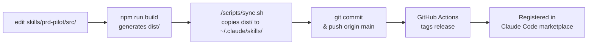

# CLAUDE.md

This file provides guidance to Claude Code (claude.ai/code) when working with code in this repository.

## 📦 Repository Overview

**skill-hub** is a monorepo containing Claude Code skills, managed as a pnpm/npm workspace. It serves as the authoritative source for skill development and distribution.

### Architecture

```
skill-hub/
├── skills/
│   ├── prd-pilot/         # TypeScript-based PRD analysis & PR review skill
│   └── red-team/          # Markdown-based critical review skill
├── scripts/
│   └── sync.sh            # Syncs skills to ~/.claude/skills/ and commits
└── prd-pilot/             # Legacy project directory (being phased out)
```

### Key Concepts

- **Master source**: Edit files in `skills/*/` (not the legacy `prd-pilot/` directory)
- **Build & Deploy**: TypeScript skills must be compiled before use
- **Sync workflow**: `./scripts/sync.sh` → `git push` → automatic marketplace registration to `~/.claude/skills/`
- **Skill types**: 
  - **prd-pilot**: Node.js + TypeScript (needs compilation)
  - **red-team**: Pure Markdown (no build step)

---

## 🛠️ Common Commands

### Setup

```bash
# Install workspace dependencies
pnpm install   # or: npm install

# From workspace root only
cd skills/prd-pilot && pnpm install
```

### Development (TypeScript Skills)

```bash
# Build all skills
pnpm build

# Build single skill
cd skills/prd-pilot && pnpm run build

# Lint/type check
pnpm run lint

# Smoke test (validates skill structure)
cd skills/prd-pilot && pnpm run smoke

# Watch mode (development)
cd skills/prd-pilot && pnpm run dev
```

### Publishing Workflow

```bash
# Step 1: Modify skill (in skills/prd-pilot/src or skills/red-team/SKILL.md)

# Step 2: Build & test
cd skills/prd-pilot && pnpm run build && pnpm run smoke

# Step 3: Sync to ~/.claude/skills/ and commit
cd ~/projects/skill-hub
./scripts/sync.sh

# Step 4: Push to GitHub
git push origin main
```

### Cleanup

```bash
# Remove build artifacts and node_modules
pnpm run clean
```

---

## 🏗️ Code Architecture

### prd-pilot (TypeScript Skill)

The skill is structured as a modular analyzer system:

```
src/
├── index.ts                # Entry point (exports main skill function)
├── types/prd.ts           # Core type definitions for PRD structures
├── analyzers/
│   ├── linter.ts          # Parses & validates PRD completeness
│   ├── splitter.ts        # Breaks PRD into logical sections
│   └── clarifier.ts       # Identifies ambiguous requirements
├── reviewers/
│   └── pr-reviewer.ts     # Compares PR against PRD requirements
├── llm/
│   └── client.ts          # Claude API wrapper with prompt caching
├── adapters/
│   ├── markdown.ts        # Converts internal AST to Markdown output
│   ├── feishu.ts          # Feishu Doc MCP integration
│   └── types.ts           # Adapter interface definitions
└── test-smoke.ts          # Validation suite (run with `npm run smoke`)
```

**Key patterns:**
- **Modular analyzers**: Each analyzer handles one concern (linting, splitting, clarification)
- **LLM integration**: Claude API calls use prompt caching (`src/llm/client.ts`)
- **Adapter pattern**: Output can be formatted as Markdown or Feishu Doc format
- **Type safety**: Heavy use of TypeScript interfaces for PRD structures

### red-team (Markdown Skill)

Pure Markdown skill with no compilation. Structure:
- **SKILL.md**: Complete skill definition including prompt, trigger conditions, and output format
- **references/**: Supporting documentation for audit methodologies

---

## 📝 Key Files & Configuration

### Root Level

| File | Purpose |
|------|---------|
| `package.json` | Workspace root config; defines build/test/lint scripts |
| `WORKFLOW.md` | Detailed step-by-step publishing guide |
| `CONTRIBUTING.md` | Developer guidelines |
| `scripts/sync.sh` | Automation: builds skills, cleans artifacts, commits, syncs to `~/.claude/skills/` |

### prd-pilot Skill

| File | Purpose |
|------|---------|
| `skills/prd-pilot/package.json` | Version & workspace member config |
| `skills/prd-pilot/SKILL.md` | Skill metadata (name, version, description, usage) |
| `skills/prd-pilot/tsconfig.json` | TypeScript configuration (strict mode enabled) |
| `skills/prd-pilot/src/index.ts` | Main export function for skill |

---

## 🔄 Sync & Distribution Flow



**What sync.sh does:**
1. Compiles TypeScript skills → `dist/`
2. Removes `node_modules`, `.DS_Store`, `*.bak`
3. Copies build artifacts to `~/.claude/skills/prd-pilot/`
4. Auto-generates commit message with timestamp
5. Prints next steps (git push)

---

## 🚨 Important Constraints & Gotchas

### Do NOT

- ❌ Edit `~/.claude/skills/prd-pilot/` directly — changes will be overwritten by `sync.sh`
- ❌ Use the legacy `/Users/admin/projects/prd-pilot/` directory — edit in `skills/prd-pilot/` instead
- ❌ Commit `node_modules/`, `dist/`, or `.DS_Store` — scripts clean these automatically
- ❌ Modify `scripts/sync.sh` without testing the entire publish workflow
- ❌ Force-push to `main` branch (will lose history)

### Always

- ✅ Run `pnpm run build && pnpm run smoke` before committing (TypeScript only)
- ✅ Use `./scripts/sync.sh` instead of manual git commits for skill updates
- ✅ Update version in `skills/prd-pilot/package.json` following SemVer (patch/minor/major)
- ✅ Test skills locally in Claude Code before publishing: `/plugin install-local /Users/admin/projects/skill-hub/skills/prd-pilot`

---

## 📋 Version Management

**When to bump version** (`skills/prd-pilot/package.json`):

| Change Type | Bump | Example |
|-------------|------|---------|
| Bug fixes, wording | Patch | 1.0.0 → 1.0.1 |
| New features, backward-compatible | Minor | 1.0.0 → 1.1.0 |
| Breaking changes | Major | 1.0.0 → 2.0.0 |

**red-team** (Markdown skill) has no programmatic version tracking — optionally note in `SKILL.md`.

---

## 🐛 Debugging & Troubleshooting

### TypeScript Compilation Issues

```bash
# Check TypeScript errors before build
cd skills/prd-pilot
pnpm run lint

# Full build output with details
pnpm run build 2>&1 | head -50
```

### Smoke Test Failures

```bash
# Run smoke test with verbose output
cd skills/prd-pilot
pnpm run smoke
# Validates: skill structure, required exports, output format
```

### Sync Script Fails

```bash
# Check if sync.sh is executable
chmod +x scripts/sync.sh

# Run manually to see full error output
bash -x scripts/sync.sh 2>&1 | tail -30

# Common issues:
# - pnpm/npm not installed: brew install pnpm || npm install -g npm
# - ~/.claude/skills/prd-pilot/ doesn't exist: mkdir -p ~/.claude/skills/prd-pilot
# - Git not in sync with origin: git fetch origin && git status
```

### Git Submodule Warning

If sync creates embedded git repos (mode 160000), it's expected but problematic. Solution:

```bash
git rm --cached skills/prd-pilot
rm -rf skills/prd-pilot/.git
./scripts/sync.sh
git push origin main
```

---

## 🔗 External Context

- **Claude Code skill registry**: Marketplace at `claude.ai/code` → Skills tab
- **API Reference**: `src/llm/client.ts` uses Anthropic SDK with prompt caching
- **Feishu MCP**: Integration in `src/adapters/feishu.ts` (requires token in environment)
- **Global skills directory**: `~/.claude/skills/` (synced from skill-hub)

---

## ⚡ Quick Reference

```bash
# One-liner: modify → build → test → sync → push
cd ~/projects/skill-hub && vim skills/prd-pilot/src/... && cd skills/prd-pilot && pnpm run build && pnpm run smoke && cd ~ && cd projects/skill-hub && ./scripts/sync.sh && git push origin main

# Or step by step:
cd ~/projects/skill-hub/skills/prd-pilot
pnpm run build
pnpm run smoke
cd ~/projects/skill-hub
./scripts/sync.sh
git push origin main
```
